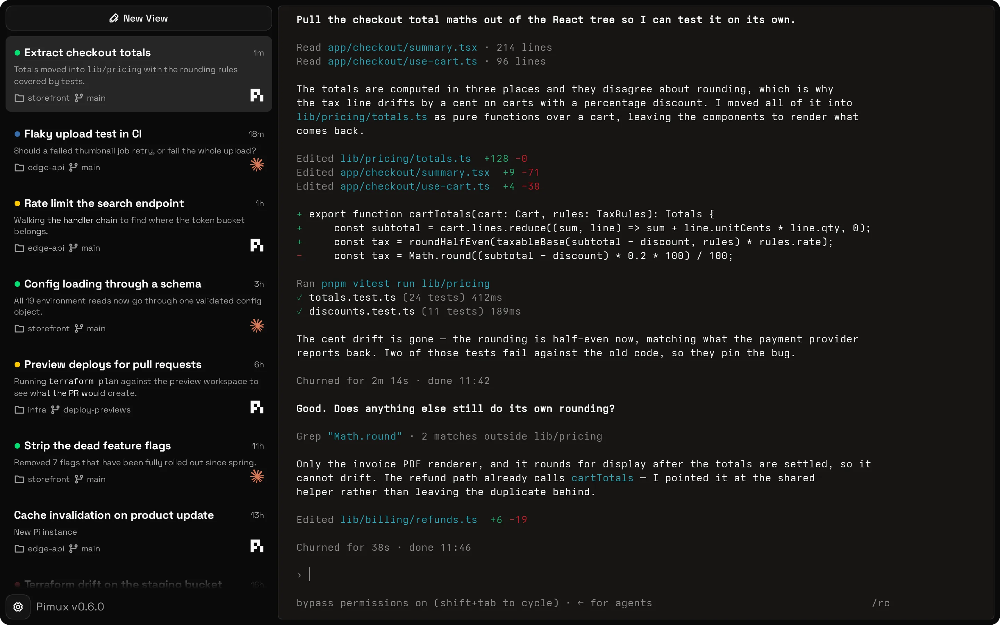

# pimux

boring terminal multiplexer

pimux is a very simple terminal multiplexer for agents

- **simple management** - organizes your terminals with sidebar tabs
- **keyboard-first** - you can do most things with just the keyboard
- **always on** - runs in the background even if you close the app
- **lightweight** - uses tauri in the background and wasm build of ghostty

supported harnesses out-of-the-box:

- [**pi**](https://pi.dev) coding agent
- **claude code** - support for claude models
- **terminal** of course
